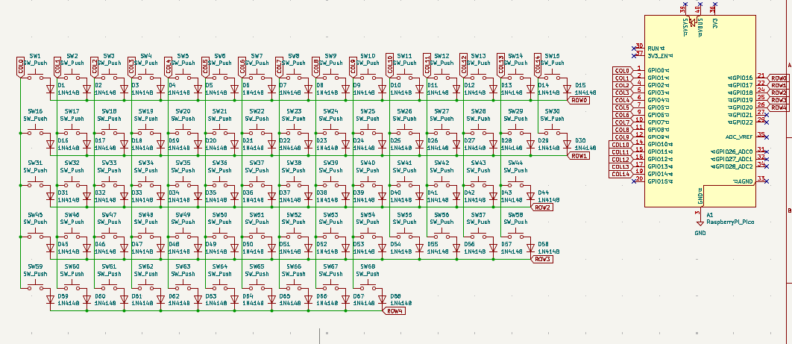
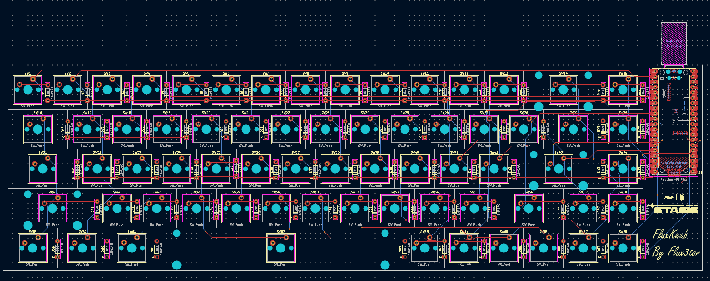
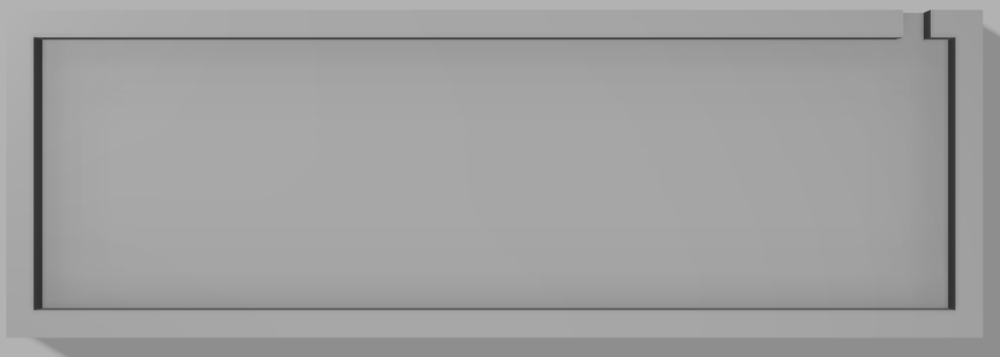
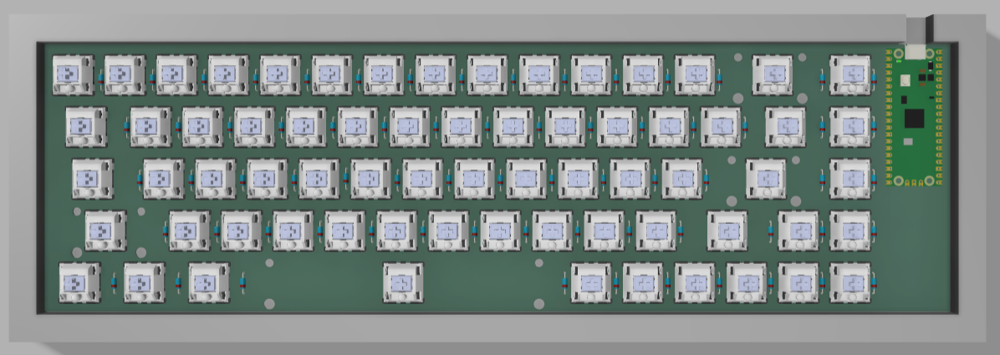
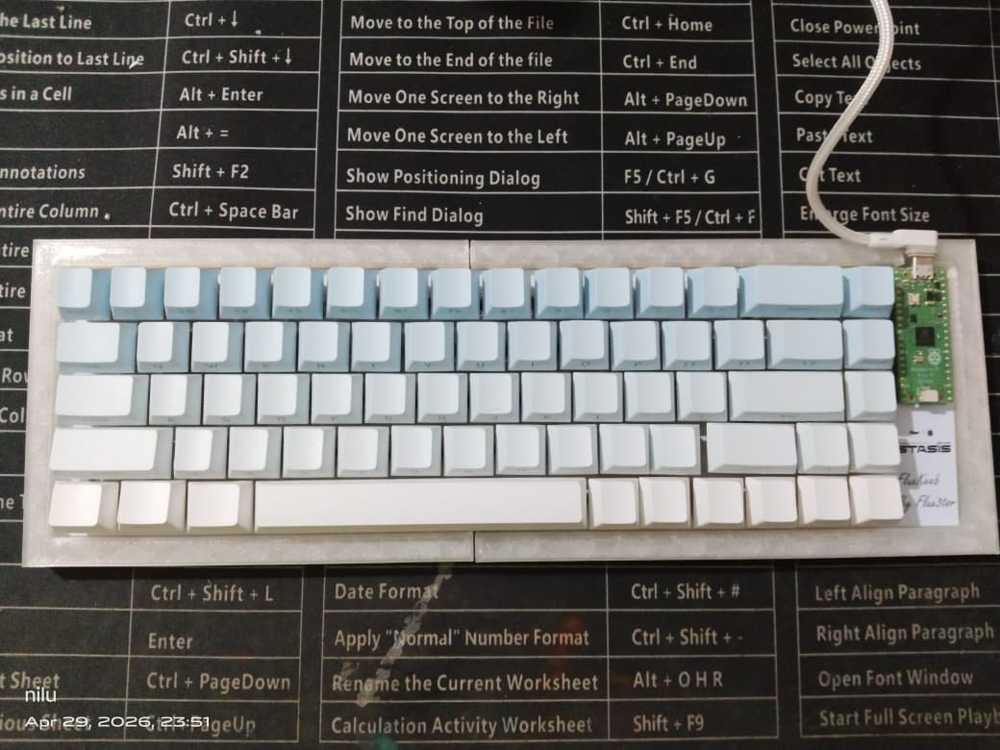
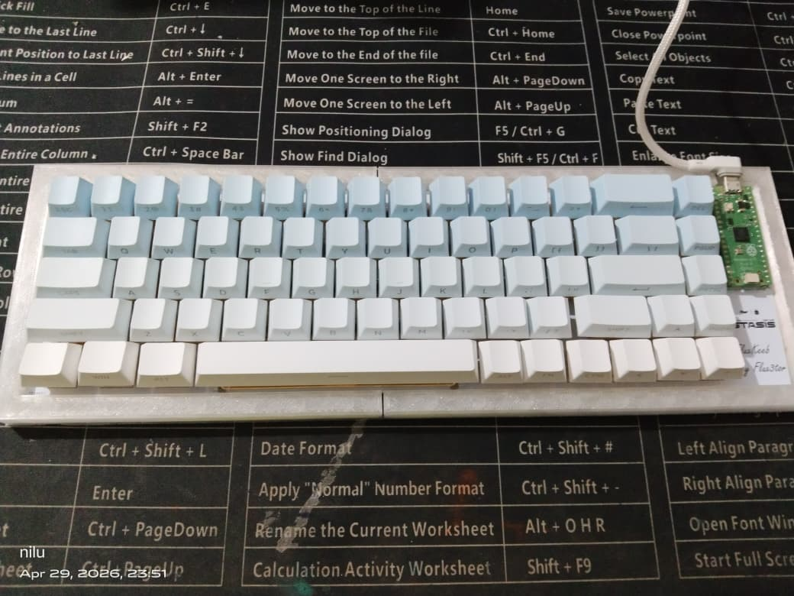

# FluxKeeb

FluxPad is a custom 65% keyboard powered by the Raspberry Pi Pico  
It features a Raspberry Pi Pico as its main controller, Akko V5 Creamy Yellow Pro as the switches and a compact 3D-printed case!

---

## Why did I make it?

So my first project was actually a Macropad, but I was too lazy to make more projects and ofcourse too lazy to do this also, but I need a keyboard badly as my current one broke, so I made it instead of spending money to buy one

---

## Project Images

### Schematic

### PCB

### Case Design
#### Bottom Case

### Final Layout

---

Features:
- 68 keys
- Raspberry Pi Pico
- Customised layout
- QMK firmware
- FluxKeeb Branded PCB
- Custom case

---

## BOM
|Name                                                         |Purpose                         |Quantity|Total Cost (USD)|Link                                                                             |Distributor    |
|-------------------------------------------------------------|--------------------------------|--------|----------------|---------------------------------------------------------------------------------|---------------|
|Akko V5 Creamy Yellow Pro Switch (Pack of 45)                |switches for the keyboard!      |2       |25.77           |https://stackskb.com/store/akko-v5-creamy-yellow-pro-switch-pack-of-45/              |StacksKB       |
|Veekos Gradient Keycaps (Cherry Profile) (135 keys) (Blue)   |keycaps for the keyboard's switches!        |1       |13.96           |https://stackskb.com/store/veekos-gradient-keycaps-cherry-profile-135-keys/      |StacksKB       |
|Durock Clear Screw-In Stabilizers V2 (4+1 w/ 6.25u spacebar)|Stabilizers for the big keys like spacebar     |1       |17.14           |https://stackskb.com/store/durock-clear-screw-in-stabilizers-v2/?attribute_combination=4%2B1+Set&attribute_spacebar-size=6.25U               |StacksKB       |
|1N4148 Diode (100 Pieces)                                  |Diodes for the switch matrix!          |1       |1.60            |https://www.amazon.in/gp/product/B084ZP5BJ3                         |Amazon         |
|Raspberry Pi Pico                                            |main controller for the keyboard!         |1       |5.36            |https://robu.in/product/raspberry-pi-pico-with-headers/          |Robu         |
|PCB                                                          |pcb for the keyboard!        |5       |9.00           |https://www.allpcb.com/                                                              |ALLPCB          |
|Case                                                         | shipping for the case|1       |5.00            |https://printlegion.hackclub.com/                                                                                 |Printing Legion|

## Shipping
Amazon + StacksKB = ~$1.5

Printing Legion = ~$5

Total Shipping = $6.5

## Total Pricing
The total price comes out to be **7,532 INR ($80.93) with shipping**

## Build Process

I finally finished making the project did all the soldering and connected everything properly had to be careful with the joints so nothing messes up, after that i assembled the whole thing and checked all the connections tested it and yeah it actually worked which was nice

Overall it turned out good and now i actually get soldering way better than before!

---

## Final Build

---
